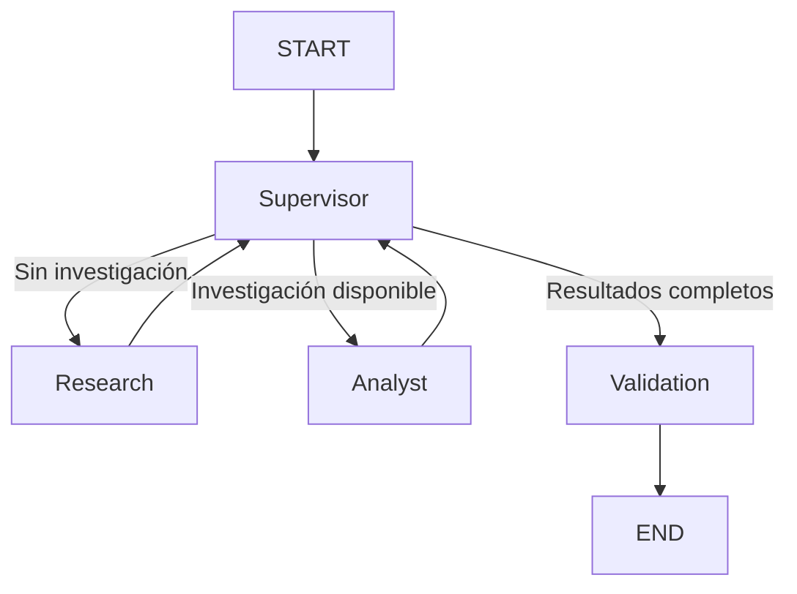

# Sistema Multiagente con LangGraph

Proyecto desarrollado utilizando LangGraph para implementar
un sistema multiagente compuesto por un supervisor y diferentes
agentes especializados.

## Arquitectura

El sistema contiene los siguientes componentes:

- Supervisor
- Research Agent
- Analyst Agent
- Validation Node

El supervisor analiza dinámicamente el estado compartido y
decide cuál será el siguiente agente encargado de continuar
el procesamiento.

## Diagrama del grafo



## Topología

Se eligió una arquitectura centralizada basada en un nodo
Supervisor.

El Supervisor es responsable de decidir dinámicamente qué
especialista debe ejecutarse dependiendo de la información
disponible en el estado compartido.

El Research Agent obtiene información utilizando una
herramienta de búsqueda sobre una base de conocimiento local.

El Analyst Agent procesa los resultados obtenidos por el
Research Agent y utiliza una herramienta para identificar
los conceptos principales.

Finalmente, el nodo Validation verifica que los resultados
generados por los especialistas cumplan una serie de
condiciones mínimas antes de finalizar el flujo.

## Manejo de conflictos entre agentes

Los agentes no modifican directamente el trabajo de otros
especialistas.

Todos comparten información mediante el estado del grafo y
el Supervisor controla el orden de ejecución.

Además, antes de finalizar el flujo, el nodo Validation
comprueba la calidad mínima de los resultados.

Esta arquitectura reduce posibles conflictos entre los
agentes y permite que cada especialista tenga una
responsabilidad claramente definida.

## Estructura

```text
entrega_langgraph/
│
├── agents/
│   ├── __init__.py
│   ├── research_agent.py
│   └── analyst_agent.py
│
├── state.py
├── tools.py
├── graph.py
├── main.py
├── requirements.txt
└── README.md
```

## Instalación

Crear un entorno virtual:

```bash
python -m venv .venv
```

Activar el entorno en Windows:

```bash
.venv\Scripts\Activate.ps1
```

Instalar las dependencias:

```bash
pip install -r requirements.txt
```

## Ejecución

Ejecutar:

```bash
python main.py
```

Luego ingresar una consulta, por ejemplo:

```text
¿Qué es LangGraph?
```

El Supervisor enviará la consulta al Research Agent,
posteriormente al Analyst Agent y finalmente al nodo
Validation.