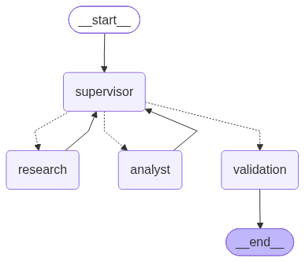

# Sistema Multiagente con LangGraph

Proyecto desarrollado con **LangGraph** para implementar un sistema multiagente simple, con una arquitectura centralizada basada en un **Supervisor** que coordina agentes especializados.

## Objetivo del proyecto

El objetivo es demostrar cómo modelar un flujo multiagente usando un grafo con estado compartido, en el que distintos especialistas colaboran de forma ordenada para responder una consulta.

El sistema trabaja con:

- un **Supervisor** que decide dinámicamente qué nodo ejecutar;
- un **Research Agent** que obtiene información;
- un **Analyst Agent** que analiza la información obtenida;
- un nodo de **Validation** que verifica la calidad mínima del resultado antes de finalizar.

---

## Arquitectura multiagente

El sistema está compuesto por los siguientes nodos:

- **Supervisor**
- **Research Agent**
- **Analyst Agent**
- **Validation Node**

La arquitectura es **centralizada**, porque el Supervisor controla el flujo y decide qué nodo debe ejecutarse en cada momento según el estado compartido.

---

## Flujo general

El flujo esperado del grafo es:

**START → Supervisor → Research → Supervisor → Analyst → Supervisor → Validation → END**

### Explicación del flujo

1. **Supervisor**
   - analiza el estado actual;
   - si todavía no existe `research_result`, delega en `Research`;
   - si ya existe `research_result` pero no existe `analysis_result`, delega en `Analyst`;
   - si ambos resultados ya existen, delega en `Validation`.

2. **Research Agent**
   - recibe la consulta del usuario;
   - utiliza la herramienta `buscar_informacion()`;
   - guarda el resultado en `research_result`.

3. **Analyst Agent**
   - toma `research_result`;
   - utiliza la herramienta `extraer_palabras_clave()`;
   - genera un análisis textual;
   - guarda el resultado en `analysis_result`.

4. **Validation Node**
   - comprueba que la investigación y el análisis no estén vacíos ni sean demasiado cortos;
   - si la validación es correcta, establece `validated = True`;
   - genera `final_answer`.

5. **END**
   - el flujo finaliza cuando el nodo Validation termina su trabajo.

---

## AgentState

El proyecto utiliza un estado compartido definido con `TypedDict` en `state.py`.

Campos del estado:

- `query`: consulta inicial del usuario.
- `next_agent`: siguiente nodo que debe ejecutar el Supervisor.
- `research_result`: resultado producido por el Research Agent.
- `analysis_result`: resultado producido por el Analyst Agent.
- `validated`: indica si la salida final superó la validación.
- `final_answer`: respuesta final del sistema.

Este estado permite que todos los nodos compartan información sin sobrescribir directamente el trabajo de los demás.

---

## Supervisor

El Supervisor es el nodo central del sistema.

Su función es analizar el estado actual y decidir dinámicamente qué nodo ejecutar después. Para ello utiliza:

- `Literal`
- `add_conditional_edges()`

La decisión se basa en si ya existen o no los resultados intermedios del flujo.

Esto permite una delegación clara y controlada.

---

## Research Agent

El **Research Agent** es el especialista de investigación.

Responsabilidades:

- leer la consulta del usuario desde `query`;
- ejecutar la herramienta `buscar_informacion()`;
- devolver un diccionario con `research_result`.

Este agente **no analiza**, solo obtiene información.

---

## Analyst Agent

El **Analyst Agent** es el especialista de análisis.

Responsabilidades:

- leer `research_result`;
- procesar esa información;
- ejecutar la herramienta `extraer_palabras_clave()`;
- devolver un diccionario con `analysis_result`.

Este agente se mantiene separado del Research Agent para demostrar especialización de tareas.

---

## Validation Node

El nodo **Validation** verifica que la salida tenga una calidad mínima antes de finalizar.

Actualmente valida que:

- `research_result` no sea vacío;
- `research_result` tenga una longitud mínima;
- `analysis_result` no sea vacío;
- `analysis_result` tenga una longitud mínima.

Si la validación es correcta:

- `validated = True`
- `final_answer` contiene la respuesta validada.

Si falla:

- `validated = False`
- `final_answer` contiene el detalle del problema detectado.

---

## Herramientas

Las herramientas se encuentran en `tools.py`.

### `buscar_informacion(consulta: str) -> str`

Realiza una búsqueda local sobre una base de conocimiento simple.

Características:

- no depende de APIs externas;
- no requiere claves;
- devuelve siempre una respuesta textual.

### `extraer_palabras_clave(texto: str) -> str`

Analiza el texto recibido y devuelve palabras clave frecuentes.

---

## Manejo de conflictos entre agentes

Los agentes no compiten entre sí ni pisan directamente el resultado de otros.

El manejo de conflictos se resuelve mediante:

- un estado compartido bien definido;
- una topología centralizada;
- un Supervisor que controla el orden de ejecución;
- un nodo Validation que verifica el resultado antes de finalizar.

Esto garantiza que cada agente tenga una responsabilidad clara.

---

## Condición de finalización

La ejecución termina cuando:

- el Supervisor envía el flujo a `Validation`;
- `Validation` genera `final_answer`;
- el grafo avanza a `END`.

De esta forma se evita que el flujo siga ejecutándose indefinidamente.

---

## Estructura real del repositorio

```text
sistema-multiagente-langgraph/
│
├── agents/
│   ├── __init__.py
│   ├── research_agent.py
│   └── analyst_agent.py
│
├── state.py
├── tools.py
├── graph.py
├── main.py
├── generate_diagram.py
├── demo.ipynb
├── requirements.txt
├── README.md
├── graph.mmd
└── graph.png
```

---

## Diagrama del grafo

El siguiente diagrama fue generado automáticamente a partir del grafo implementado en `graph.py` utilizando `generate_diagram.py`.



El código Mermaid generado automáticamente también se encuentra disponible en:

```text
graph.mmd
```

---

## Instalación

### 1. Crear el entorno virtual

```bash
python -m venv .venv
```

### 2. Activarlo en Windows PowerShell

```bash
.venv\Scripts\Activate.ps1
```

### 3. Instalar dependencias

```bash
pip install -r requirements.txt
```

---

## Ejecución

Para ejecutar la demo principal por consola:

```bash
python main.py
```

Luego ingresar una consulta, por ejemplo:

```text
Explicá qué es LangGraph, cómo se relaciona con sistemas multiagente y cuáles son sus conceptos principales.
```

---

## Ejemplo de ejecución

Durante la ejecución se observa un flujo similar a este:

```text
[SUPERVISOR] Analizando estado...
[SUPERVISOR] Siguiente nodo: research

[RESEARCH AGENT]
...

[SUPERVISOR] Analizando estado...
[SUPERVISOR] Siguiente nodo: analyst

[ANALYST AGENT]
...

[SUPERVISOR] Analizando estado...
[SUPERVISOR] Siguiente nodo: validation

[VALIDATION] Validando resultados...
```

Al finalizar, el sistema muestra:

- la respuesta validada;
- el análisis generado;
- la respuesta final del flujo.

---

## Notebook de demostración

El archivo:

```text
demo.ipynb
```

demuestra el funcionamiento del sistema paso a paso.

Incluye:

- importación del grafo;
- carga de una consulta de prueba;
- ejecución con `graph.invoke()`;
- visualización de:
  - `query`
  - `research_result`
  - `analysis_result`
  - `validated`
  - `final_answer`

Esto permite cumplir con el requisito de mostrar el flujo de delegación sin necesidad de grabar un video.

---

## Generación automática del diagrama

El archivo:

```text
generate_diagram.py
```

permite generar automáticamente el diagrama del grafo real.

Ejecutar:

```bash
python generate_diagram.py
```

Esto genera:

- `graph.mmd` → código Mermaid generado desde LangGraph.
- `graph.png` → imagen del grafo generada automáticamente.

El diagrama se obtiene a partir de:

- `graph.get_graph()`
- `draw_mermaid()`
- `draw_mermaid_png()`

Esto garantiza que el diagrama corresponda al grafo implementado y no a una versión manual desactualizada.

---

## Tecnologías utilizadas

- Python
- LangGraph

---

## Dependencias

El archivo `requirements.txt` contiene únicamente la dependencia necesaria para este proyecto:

```text
langgraph
```

---

## Observación final

Este proyecto fue diseñado para ser simple, reproducible y ejecutable sin depender de APIs externas ni configuraciones adicionales complejas.